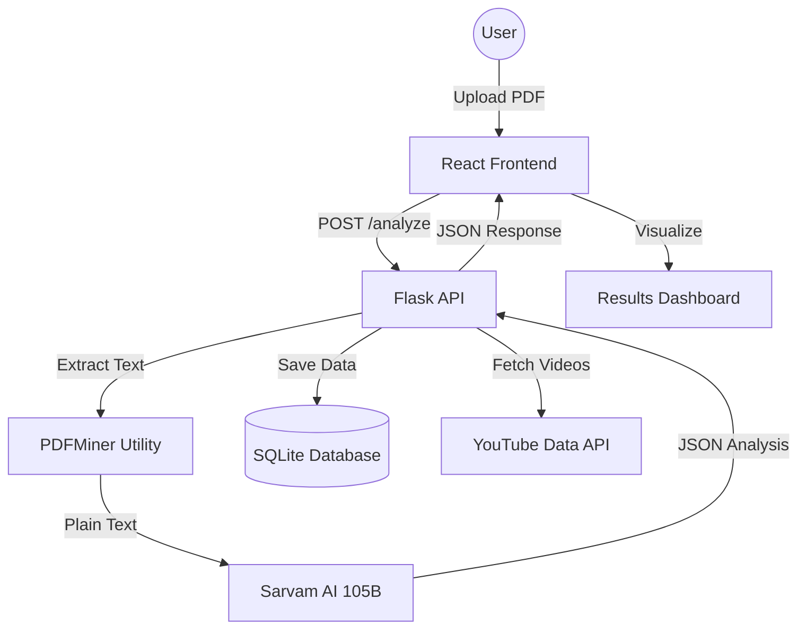

# 🤖 ResumeAI: Full-Stack AI Resume Optimizer

**ResumeAI** is a production-grade AI-powered platform designed to bridge the gap between job seekers and Applicant Tracking Systems (ATS). By leveraging **Sarvam AI's 105B model**, the application provides deep technical analysis, personalized career roadmaps, and curated learning resources to help candidates secure their dream placements.

---

## 🌟 Key Features

- **🎯 Intelligent ATS Scoring**: Evaluates resumes against modern recruitment algorithms to provide a 0-100 compatibility score.
- **🔍 Automated Gap Analysis**: Identifies missing technical skills and soft skills based on industry standards.
- **🗺️ Strategic Career Roadmap**: Generates a tailored action plan for career progression.
- **🎓 Smart Learning Hub**: Integrates with the **YouTube Data API** to recommend specific tutorials for identified skill gaps.
- **📊 Interactive Dashboard**: A centralized hub to view latest analysis metrics, historical reports, and progress.
- **💾 Analysis Persistence**: Securely stores all historical data in a local SQLite database for future reference.
- **🌓 Premium UX**: Fully responsive, dark-mode enabled interface with smooth Framer Motion animations.

---

## 🏗️ System Architecture

---

## 🛠️ Tech Stack

### Frontend
- **Framework**: [React.js](https://reactjs.org/) (Vite)
- **Animations**: [Framer Motion](https://www.framer.com/motion/)
- **Icons**: [React Icons](https://react-icons.github.io/react-icons/)
- **State Management**: React Hooks (useState, useEffect)
- **API Client**: Axios

### Backend
- **Framework**: [Flask](https://flask.palletsprojects.com/)
- **ORM**: [SQLAlchemy](https://www.sqlalchemy.org/)
- **AI Integration**: [Sarvam AI SDK](https://sarvam.ai/)
- **PDF Processing**: [PDFMiner.six](https://github.com/pdfminer/pdfminer.six)

---

## 📡 API Overview

| Endpoint | Method | Description |
| :--- | :--- | :--- |
| `/analyze-resume` | `POST` | Processes PDF upload, returns AI analysis and score. |
| `/history` | `GET` | Fetches all previous analysis records. |
| `/history/<id>` | `DELETE` | Removes a specific analysis record from the database. |
| `/resources` | `GET` | Fetches YouTube tutorials based on skills or record ID. |

---

## 📸 Screenshots

*(Add your own screenshots here to wow recruiters!)*

| Landing Page | Analysis Results |
| :---: | :---: |
|  |  |

---

## 🚀 Getting Started

### Prerequisites
- Python 3.8+
- Node.js 16+
- Sarvam AI API Key
- YouTube Data API Key

### Backend Setup
1. `pip install -r requirements.txt`
2. Configure `.env` with your API keys.
3. `python run.py`

### Frontend Setup
1. `cd frontend`
2. `npm install`
3. `npm run dev`

---

## 🔮 Future Improvements

- [ ] **Multi-User Auth**: Integrate JWT-based authentication for private user profiles.
- [ ] **Resume Comparison**: Direct comparison between a resume and a specific Job Description (JD).
- [ ] **PDF Export**: Allow users to download the AI-generated roadmap as a PDF report.
- [ ] **Real-time Collaboration**: Shared links for mentors to review analysis reports.

---

## 📄 License

Distributed under the MIT License. See `LICENSE` for more information.

---

## 📬 Contact

**Your Name** - [@yourhandle](https://twitter.com/yourhandle) - your@email.com

Project Link: [https://github.com/yourusername/resume-ai](https://github.com/yourusername/resume-ai)
